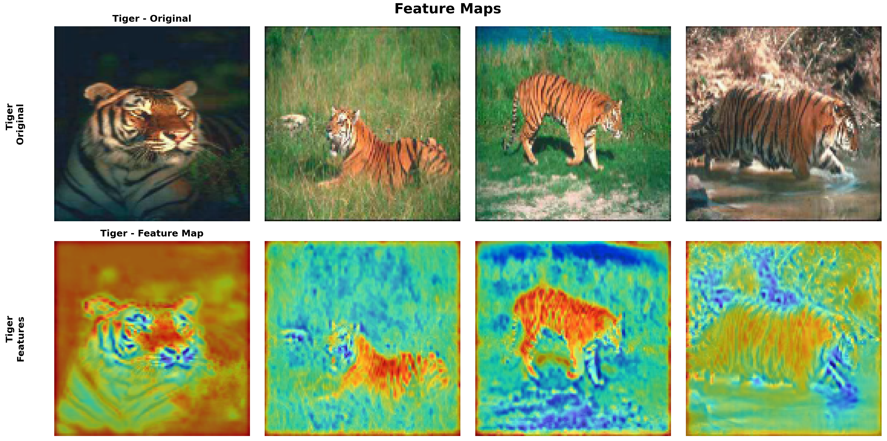

# AnimusVision

**A Deep Learning Binary Classification System for Animal Recognition**

AnimusVision is a computer vision project that leverages deep learning to perform binary classification on three distinct animal species: **Elephants**, **Tigers**, and **Foxes**. This project implements both custom CNN architectures and transfer learning approaches to achieve high-accuracy animal detection.

---

## Project Overview

This project implements two different deep learning approaches:

1. **Custom CNN Model** - A lightweight convolutional neural network built from scratch
2. **Transfer Learning Model** - Leveraging pre-trained ResNet50 for enhanced performance

Each model is trained to perform binary classification, determining whether an input image contains the target animal or not.

---

## Model Performance

### Training Progress: Basic CNN Model

The custom CNN model demonstrates steady learning across all three animal classes, with effective convergence and minimal overfitting through dropout regularization and early stopping.

*The training curves show the model's learning progression for Elephant, Tiger, and Fox classification tasks. The validation loss closely tracks the training loss, indicating good generalization.*

---

### Model Architecture Comparison

We compared the performance of our custom CNN architecture against the ResNet50 transfer learning approach across all three animal species.

*Comparative analysis showing training and validation loss for both model architectures. The transfer learning approach with ResNet50 demonstrates superior performance with faster convergence and lower final loss values.*

---

## Feature Visualization

### Activation Maps Analysis

Understanding what the model "sees" is crucial for interpretability. We visualized the convolutional layer activations to identify which regions of the image the model focuses on during classification.

*Heat map overlays showing the model's attention regions. The activation maps highlight key distinguishing features such as elephant trunks, tiger stripes, and fox facial structures, demonstrating that the model has learned meaningful patterns.*

---

## Technical Stack

- **PyTorch** - Deep learning framework
- **OpenCV** - Image processing
- **NumPy** - Numerical computations
- **Matplotlib** - Visualization
- **scikit-learn** - Data splitting and preprocessing
- **torchvision** - Pre-trained models and transforms

---

## Key Features

- **Dual Architecture Approach** - Compare custom CNN vs. transfer learning  
- **Weighted Loss Function** - Handles class imbalance effectively  
- **Early Stopping** - Prevents overfitting with patience-based monitoring  
- **Learning Rate Scheduling** - Adaptive learning rate reduction  
- **Feature Map Visualization** - Interpretable model decisions  
- **Comprehensive Evaluation** - Real-world testing with internet images  

---
