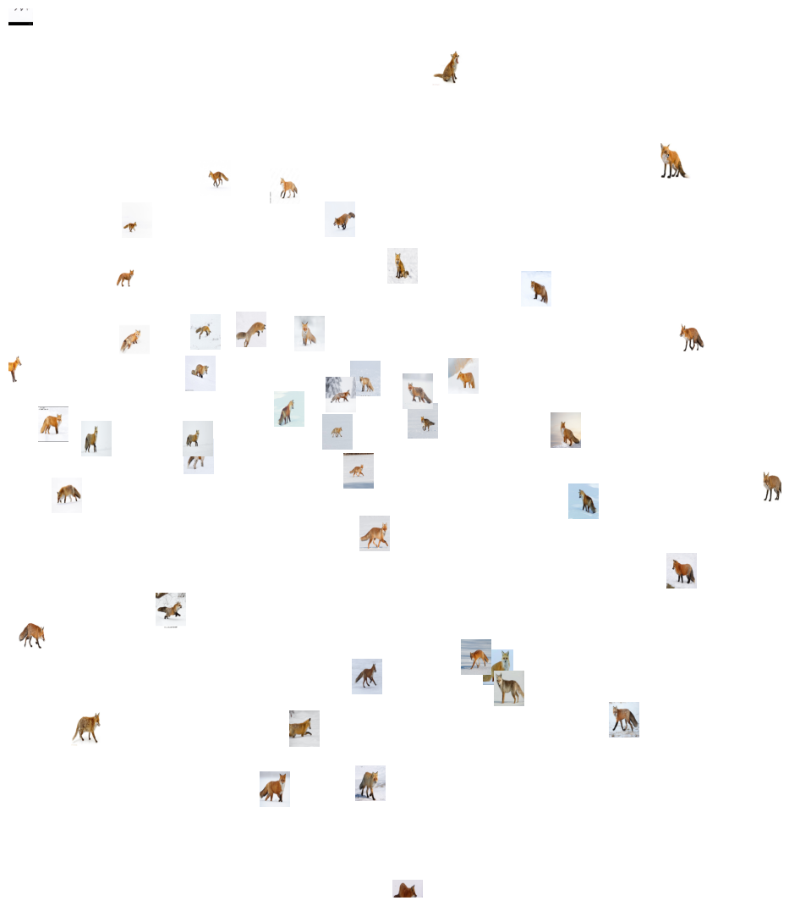
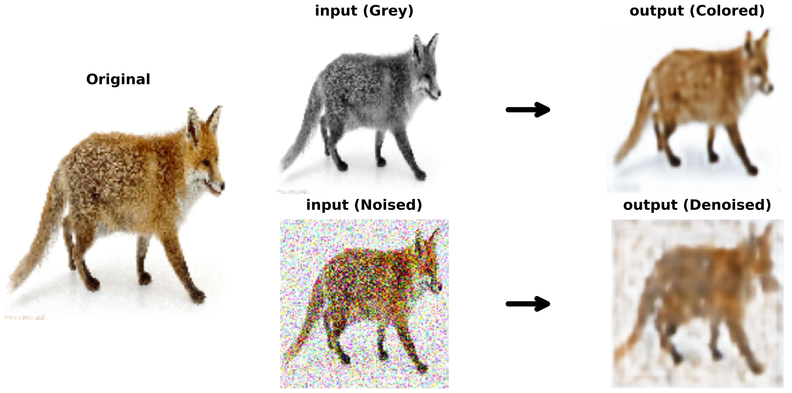
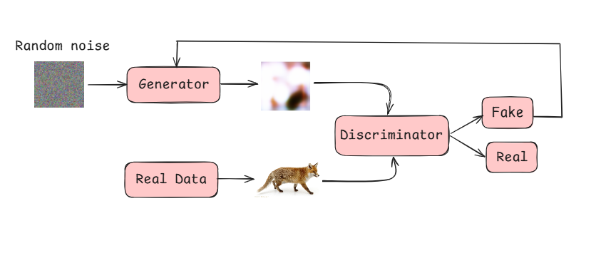

# AnimusVision

**A Deep Learning Computer Vision Suite for Animal Recognition & Generation**

AnimusVision is a  deep learning project that explores three fundamental pillars of modern computer vision: **Classification**, **Variational Autoencoders (VAE)**, and **Generative Adversarial Networks (GANs)**. 
---

## 1. Binary Classification

I implement binary classification systems to distinguish between animal species using both custom architectures and transfer learning.

### Approaches
1. **Custom CNN Model**: A lightweight convolutional neural network built from scratch.
2. **Transfer Learning**: Leveraging pre-trained **ResNet50** for superior accuracy.

### Performance & Visualization
The models demonstrate steady learning with effective convergence. I utilize **Activation Maps** to interpret what the model "sees", highlighting key features like elephant trunks or tiger stripes.


*Heat map overlays showing the model's attention regions during classification.*


*Comparative analysis showing the superior performance of Transfer Learning (ResNet50) vs Custom CNN.*

---

## 2. Variational Autoencoders (VAE)

I explore VAEs as a powerful class of generative models that map inputs to a probability distribution in a latent space, enabling diverse data generation and reconstruction.

### Latent Space Analysis
Unlike standard autoencoders, VAEs learn a continuous latent space. By projecting the 100-dimensional latent vectors to 2D using PCA, I observe **semantic clustering**, where images with similar poses or backgrounds group together.


*Visualization of the VAE latent space. The spatial arrangement reveals how the model organizes data based on learned semantic features.*

### Advanced Use Cases: Denoising & Colorization
Beyond generation, our VAE is capable of complex image restoration tasks:
- **Denoising**: Removing noise from corrupted inputs to recover clean images.
- **Colorization**: Hallucinating color information from grayscale inputs based on learned structural correlations.


*Demonstration of VAE capabilities: Top row shows reconstruction from grayscale (Colorization), Bottom row shows reconstruction from noisy inputs (Denoising).*

---

## 3. Generative Adversarial Networks (GANs)

I implement GANs to generate realistic images from random noise via an adversarial process between two competing networks.

### Architecture
The system consists of a **Generator** (creating images from noise) and a **Discriminator** (distinguishing real vs. fake), trained simultaneously in a zero-sum game.


*The Adversarial Loop: Random noise is fed to the Generator to create fake images. The Discriminator evaluates both Real Data and Fake Data, providing feedback to improve the Generator.*

### Training Progression
Training GANs is a delicate balance. I visualize the evolution of the generator's capability over thousands of epochs, observing the transition from random noise to coherent animal shapes.


*Evolution of Generation: From amorphous blobs at 100 epochs to recognizable fox shapes and textures after 7000 epochs.*

---

## Technical Stack

- **PyTorch** - Deep learning framework
- **OpenCV** - Image processing
- **NumPy** - Numerical computations
- **Matplotlib** - Visualization
- **scikit-learn** - Data splitting and preprocessing
- **torchvision** - Pre-trained models and transforms

---

## Key Features

- **Multi-Model Implementation** - CNNs, ResNet50, VAEs, and GANs
- **Generative Capabilities** - Image synthesis, denoising, and colorization
- **Latent Space Analysis** - Visualizing high-dimensional data representations
- **Model Interpretability** - Activation maps and training visualizations
- **Advanced Training** - Weighted loss, early stopping, and adversarial training

---

## Results

- **Classification**: High accuracy with ResNet50 transfer learning.
- **VAE**: Successful latent space clustering and image restoration.
- **GANs**: Generation of recognizable animal features from noise.

---

## Model Architecture Details

### Classification Models
- **Custom CNN**: Conv2d → ReLU → Dropout → MaxPool → FC layers
- **ResNet50**: Pre-trained backbone with custom classification head

### Generative Models
- **VAE**: Encoder-Decoder architecture with reparameterization trick and KL-divergence loss.
- **GAN**: DCGAN-style architecture with Transposed Convolutions for upsampling.

---

## Dataset Structure

```
Tiger-Fox-Elephant/
├── elephant/              # Positive class - elephant images
├── Elephant_negative_class/  # Negative class - non-elephant animals
├── tiger/                 # Positive class - tiger images
├── Tiger_negative_class/     # Negative class - non-tiger animals
├── fox/                   # Positive class - fox images
└── Fox_negative_class/       # Negative class - non-fox animals
```

---

## Learning Insights

This project demonstrates several important concepts in deep learning:

1. **Data Augmentation Importance** - Enhancing dataset diversity improves generalization
2. **Transfer Learning Power** - Pre-trained models accelerate training and boost performance
3. **Generative Modeling** - Understanding latent spaces (VAE) and adversarial training (GAN)
4. **Model Interpretability** - Activation maps provide insights into model decision-making
5. **Regularization Techniques** - Dropout, weight decay, and KL-divergence prevent overfitting

---

## Contributing

Contributions, issues, and feature requests are welcome! Feel free to check the issues page.

---

## License

This project is available for educational and research purposes.

---

## Author

**NASSWIEL**

Created as part of a deep learning project exploring binary classification for animal recognition.

---

*AnimusVision - Bringing clarity to animal detection through deep learning*
